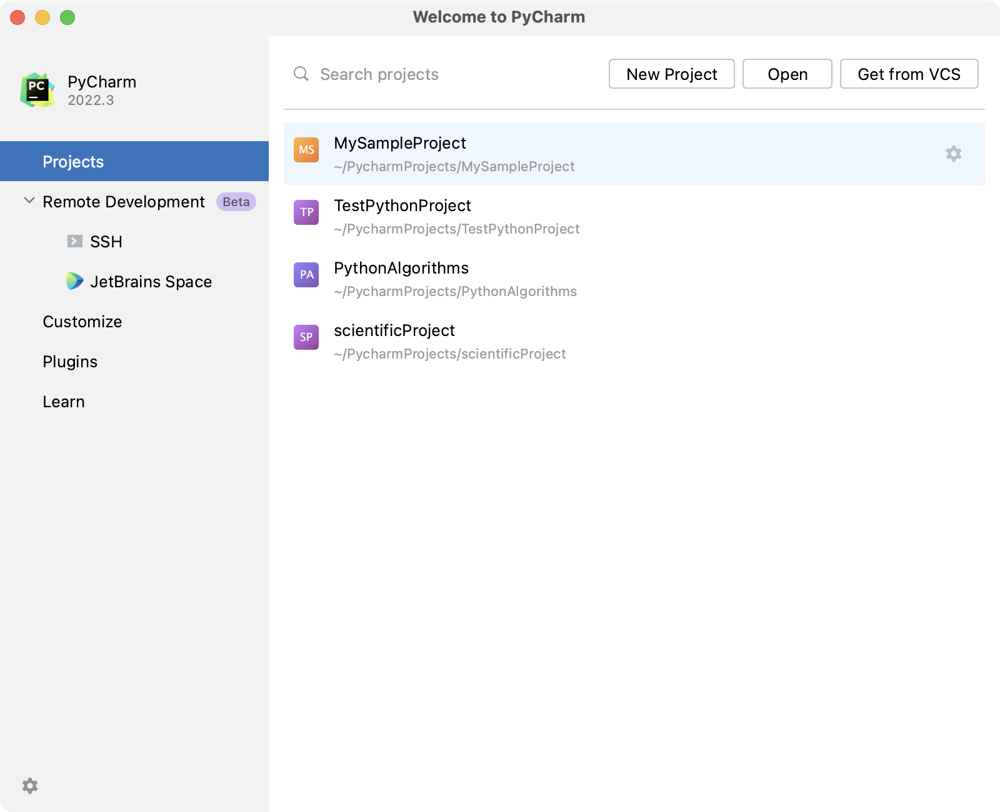
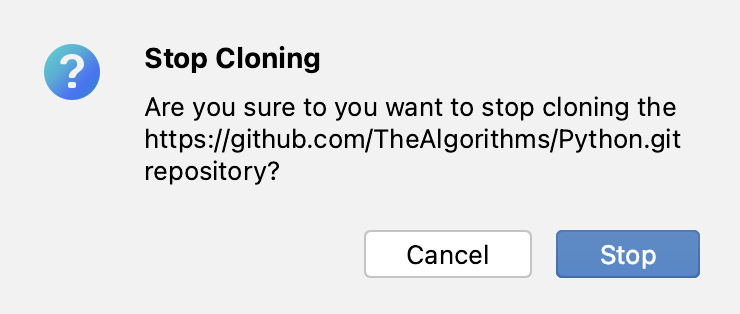
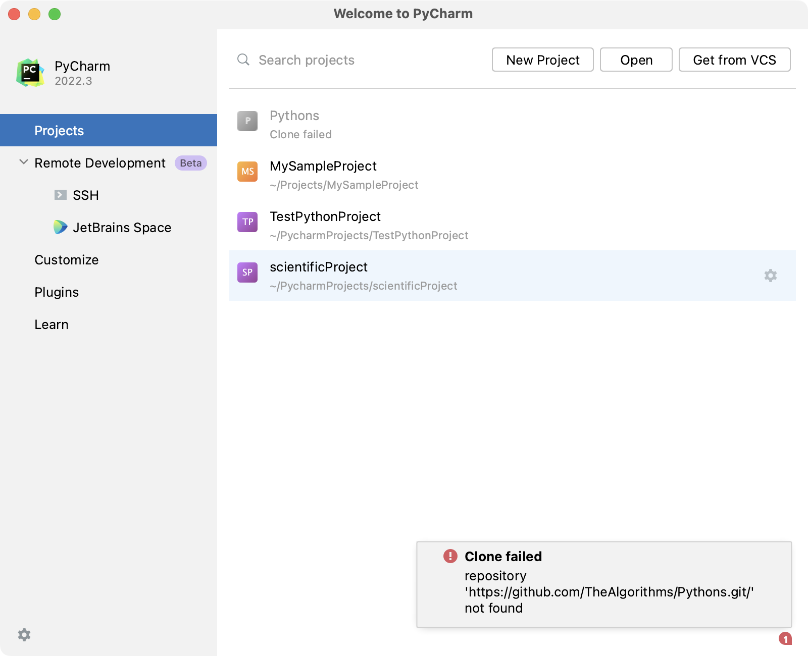

# Cloning a GitHub Repository

By cloning the GitHub repository, you copy the project from the remote location to your local computer. The purpose of cloning a remote GitHub Repository is so that you write code locally and push the modified content to the remote repository. 

## How to Clone a Repository:
1. Go to the repository you want to clone on GitHub.
2. Click on "Code".
3. Copy the URL that pops up.
4. Go to the Welcome Screen of PyCharm.

5. Click on "Get From VCS".
6. Paste the link you copied earlier into the field.
7. Click on "Clone".

 

## Stop Cloning
If you have started cloning the repository but want to stop it:

1. Click on the **X button image** on the right of the progress bar.
2. In the dialog that appears, click **Stop**. If you don't want to stop the cloning process, click **Cancel**.

 

## Clone Failure

A notification similar to the image below will appear if there is an error in cloning the repository. 

