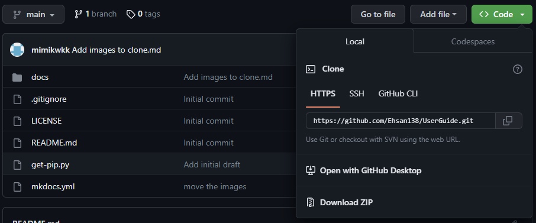
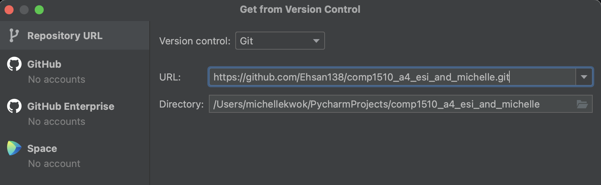
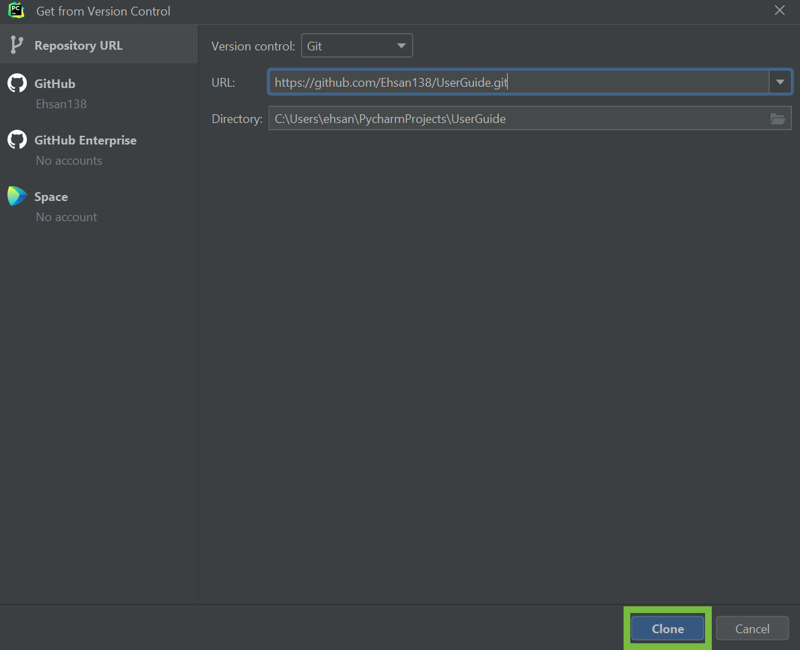
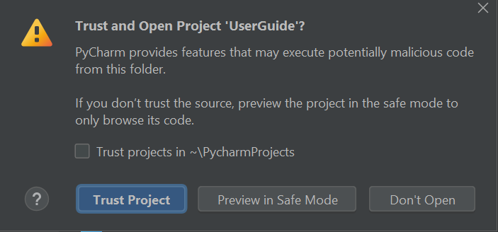
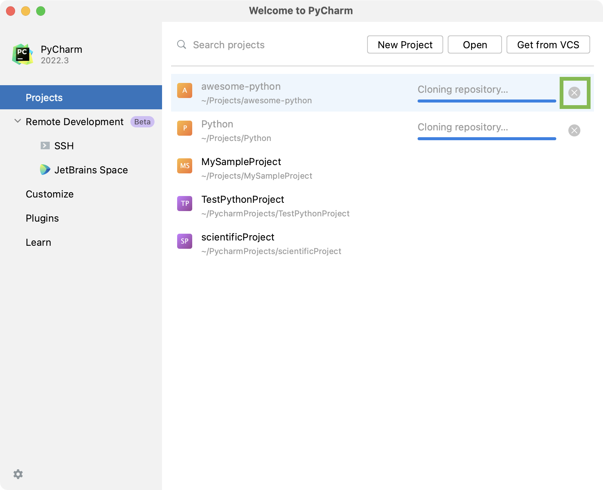

# Cloning a GitHub Repository

By cloning the GitHub repository, you copy the project from the remote location to your local computer. The purpose of cloning a remote GitHub Repository is so that you write code locally and push the modified content to the remote repository. 

## How to Clone a Repository:
1. Go to the repository you want to clone on GitHub.
2. Click on "Code".
3. Copy the URL that pops up.

{width=700}
 
4. Go to the Welcome Screen of PyCharm.
 
5. Click on "Get From VCS".

{width=700}
 
6. Paste the link you copied earlier into the field.

{width=700}
 
7. Click on "Clone".
{width=700}
 
8. Click on **Trust Project**
{width=700}

!!! success
    If the repository is succesfully cloned, the new repository will automatically pop up

!!! failure 
    A notification similar to the image below will appear if there is an error in cloning the repository. 
    {width=700}

## Stop Cloning
If you have started cloning the repository but want to stop it:

1. Click on the **X button** on the right of the progress bar.

{width=700}

2. In the dialog that appears, click **Stop**. If you don't want to stop the cloning process, click **Cancel**.

{width=700}

## Conclusion

At the end of this section, you should now know how to:

- [x] Clone a repository
- [x] Stop cloning