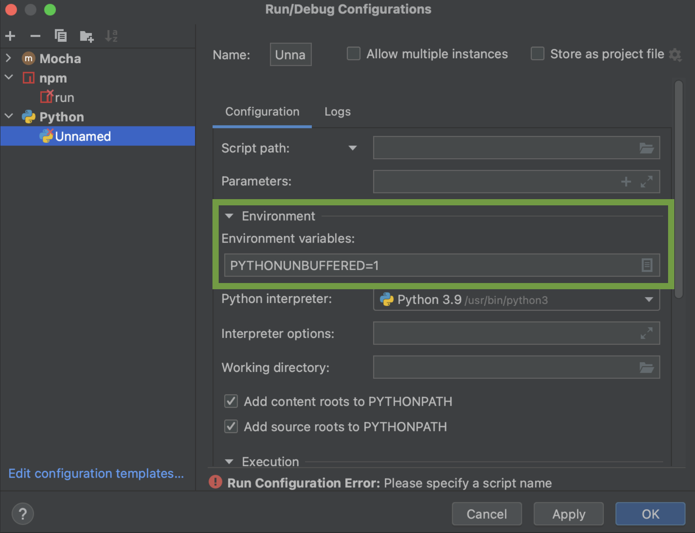

# Command Line Arguments

This section will guide you through inserting command line parameters to your IDE. Program arguments are passed when you want to give specific information to your program during runtime. Environment variables are passed to set system-wide configuration or to store sensitive information.

Before you start, make sure that you have your project open.

## How to Add Program Arguments:
1. From the main menu, select **Run | Edit Configurations**.

{ width=700 }
 
2. In the Run/Debug Configurations dialog that appears, select which configuration you want to pass the arguments.
{ width=700 }
 
3. In the **Parameters** or **Program arguments** textbox (depends on your configuration), add the arguments in question. (For ex: sample.txt).  

!!! warning
    If you have multiple arguments, separate them with spaces.

{ width=700 }
 
4. Click on "Apply".
 
5. Click on "OK".

!!! success
    If you are able to successfully pass the program arguments to your code, you should get output without any error messages.
    { width=700 }

!!! failure
    If you get error messages, it means that the program arguments were unable to be successfully passed to your code.
    { width=700 }

## How to Add Environment Variables:

1. From the main menu, select **Run | Edit Configurations**.

{ width=700 }
 
2. In the Run/Debug Configurations dialog that appears, select which configuration you want to add the environment variables.
{ width=700 }
 
3. Scroll down until you see the **Environment Variables** textbox.
 
4. Enter the variable name and value: `<name>=<value>`. 
!!! warning
    If you have multiple variables, separate them with semicolons.

{ width=700 }
 
4. Click on "Apply".
 
5. Click on "OK".

## Conclusion

At the end of this section, you should now know how to:

- [x] Add program arguments
- [x] Add environment variables

