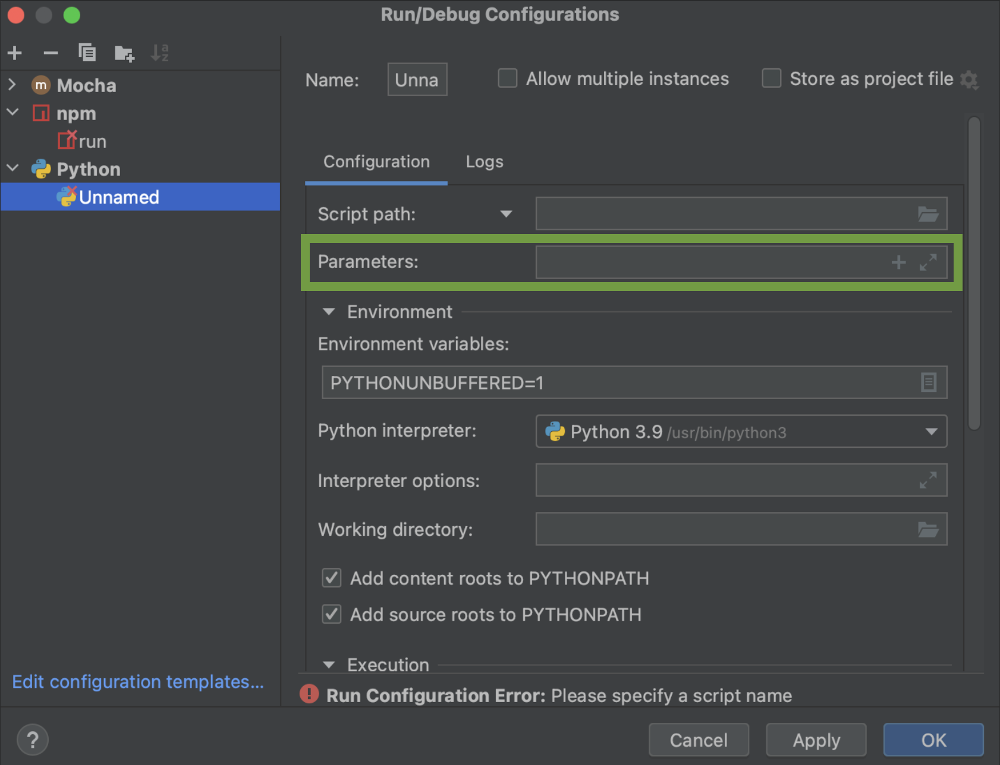

# Command Line Arguments

This section will guide you through inserting command line parameters to your IDE.

Before you start, make sure that you have your project open.

## How to Add Program Arguments:
1. From the main menu, select **Run | Edit Configurations**.

2. In the Run/Debug Configurations dialog that appears, select which configuration you want to pass the arguments.
3. In the **Parameters** or **Program arguments** textbox (depends on your configuration), add the arguments in question. (For ex: sample.txt).  If you have multiple arguments, separate them with spaces.

4. Click on "Apply".
5. Click on "OK".

## How to Add Environment Variables:
1. From the main menu, select **Run | Edit Configurations**.
2. In the Run/Debug Configurations dialog that appears, select which configuration you want to add the environment variables.
3. Enter the variable name and value: `<name>=<value>`. If you have multiple variables, separate them with semicolons.

