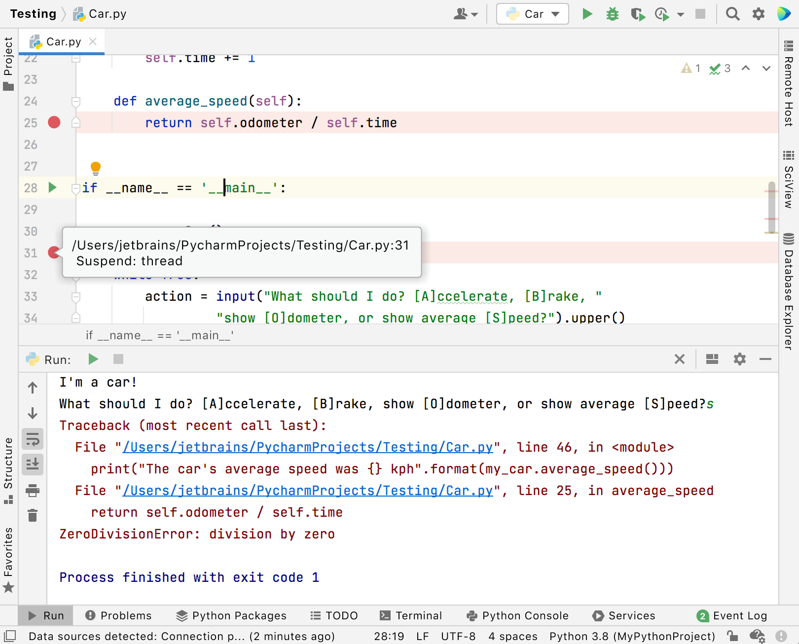
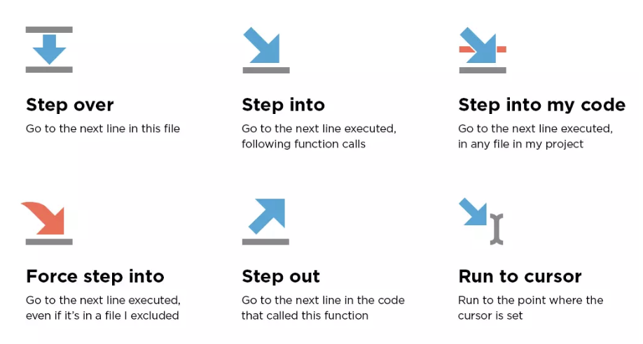
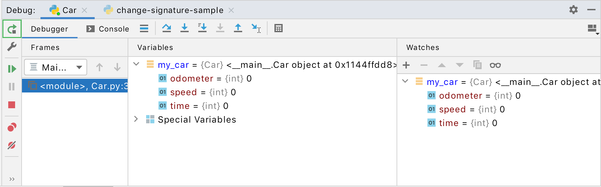
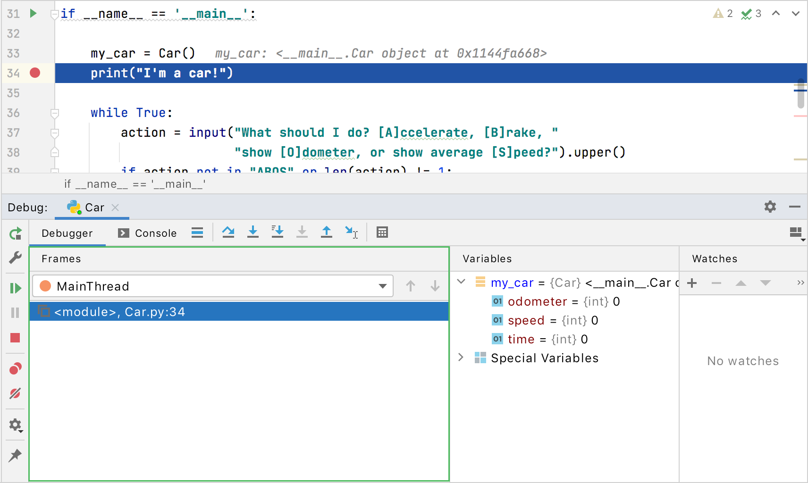
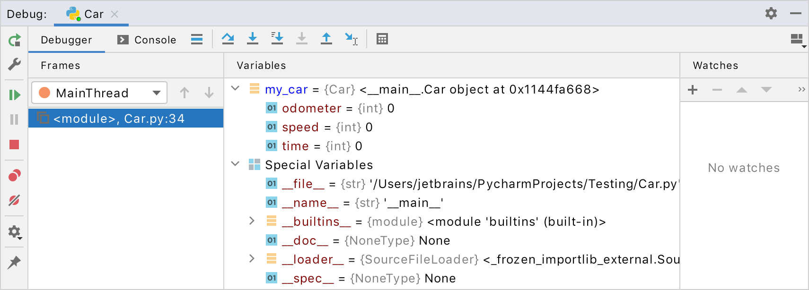
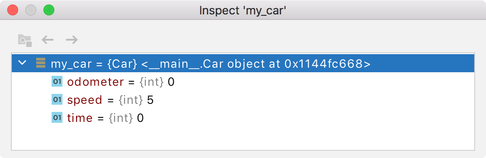
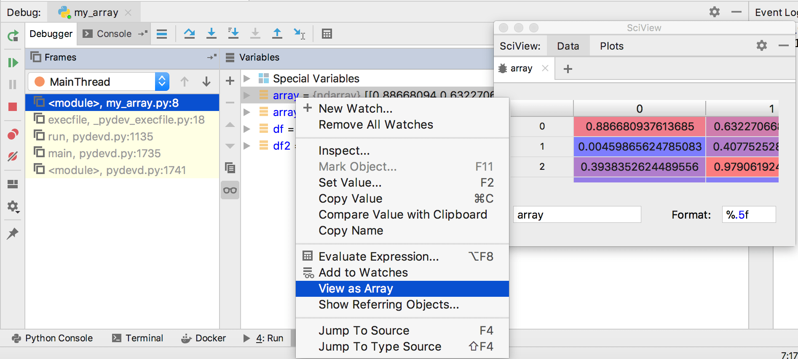
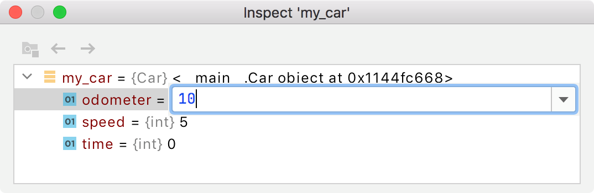
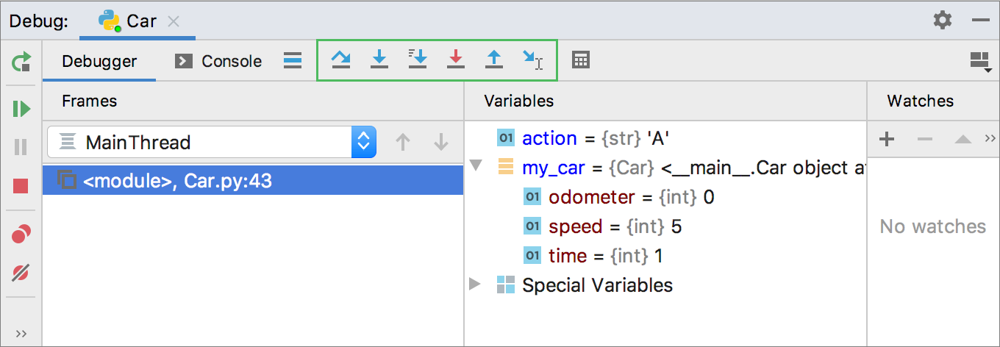
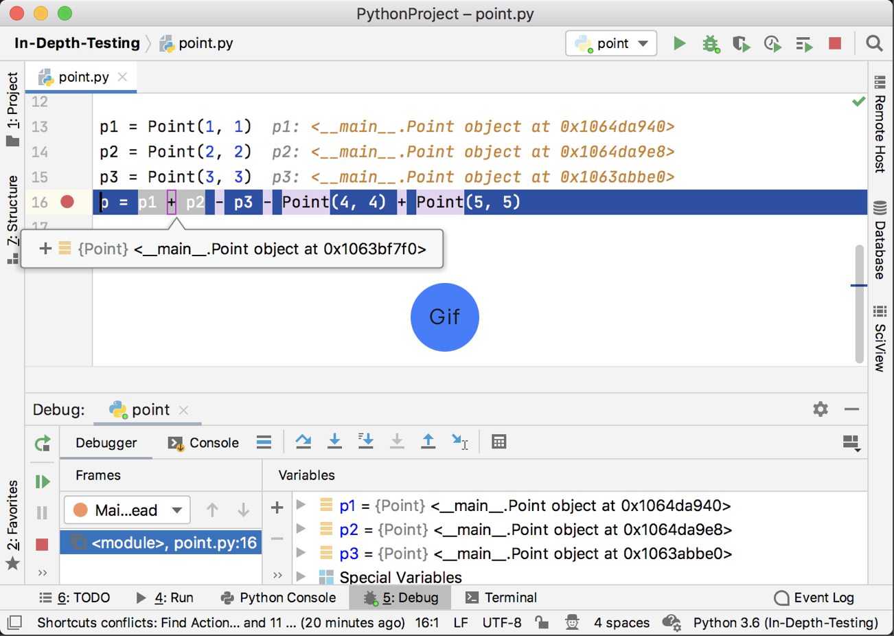

# Debugging

The debugger is a tool to help programmers detect and fix errors (bugs) in their code. It allows programmers to monitor the execution of their programs and examine the state of the program and its variables at specific points in the code.

Debuggers generally allow programmers to step through their code line by line, set breakpoints at specific lines of code, examine the value of variables and data structures, and modify the value of variables to test the effects on the program. Debuggers can also help identify problems in the flow of the program, such as infinite loops or logic errors.  

## General Debugging Procedure

Because the debugging process can vastly vary depending on your needs, we can only provide a general guide on the typical debugging procedure.

Before you start, make sure that you have your project open.
### To Start the Debugger:
1. Set a breakpoint by clicking in the gutter at the desired line of code.
    * If you need further explanation on breakpoints, read the **Breakpoints** section below.

{ width = 700}
2. Click on the Debug icon {width=20, length=40} on the top right of the program.
 
3. Click on the arrow icon that suits your requirements.
{width=700}
 
* If you need further explanation on each arrow icon, read the **Stepping Through the Debugger** section below.
 
4. To end the Debugger, click on the Stop icon {width=20} on the top right of the program.
 
5. Remove the breakpoint by clicking the red circle.

### To Pause the Debugger:
While the debugger is executing, you can pause and resume it by using the following buttons on the **Debug** toolbar:

* To pause the debugger, click {width=18}.
* To resume the debugger, click {width=18} or press ⌘ ⌥ R.

### To Restart the Debugger:
* To restart, click the **Rerun** button in the **Debug** toolbar or press ⌘ R.

{width=700}

### To Stop the Debugger:
* To terminate the debugger, click the **Stop** button {width=18} in the **Debug** toolbar or press ⌘ F2 and if there are multiple processes, select the process to terminate.

## Breakpoints
Breakpoints mark where you want the debugger to suspend the program execution so that you can examine the program at a deeper level. Breakpoints can be simple (for example, suspending the program on reaching some line of code) or involve more complex logic (checking against additional conditions, writing log messages, and so on). When a debugger pauses the execution of a program, it is said to be in a suspended state.
Please note that breakpoints do not disappear upon termination of the Debugger. They must be removed explicitly (aside from temporary breakpoints).

PyCharm has two types of breakpoints: *line breakpoints* and *exception breakpoints*.

* Line breakpoints: suspends the program on reaching the line of code with the breakpoint. This type of breakpoints can be set on any executable line of code.
* Exception breakpoints: suspend the program when exceptions are thrown. 

### Breakpoint Statuses

These are the different types of statuses breakpoints can have:

Status | Explanation
------------ | -------------
Verified | Once a debugger session has been initiated, the debugger will assess whether it is possible to freeze the program at the specified breakpoint. If the debugger determines it is possible, the debugger will indicate the breakpoint as **verified**.
Warning | In the case that the debugger deems it technically possible to suspend the program at the specified breakpoint, but there are other issues that may arise, the debugger will give a **warning**. An instance of this would be when it is impossible to pause the program at one of its method implementations.
Invalid | When the debugger determines that it is technically impossible to suspend the program at the specified breakpoint, it marks this as **invalid**. The primary reason for this is often that the line has no executable code.
Inactive/dependent | If a breakpoint has been configured to be disabled until another breakpoint is reached, and this condition has not yet been met, the breakpoint is labeled as **inactive** or **dependent**.
Muted | Breakpoints can be **muted** if you don't require them to be triggered for some time. By doing this, you can continue with normal program operation without exiting the debugging session. Once you are ready to resume debugging, you can unmute the breakpoints to reactivate them. (Click the Mute Breakpoints button in the toolbar of the Debug tool window.)
Disabled | If you delete a breakpoint, its settings will be permanently removed. However, if you want to temporarily deactivate a specific breakpoint while preserving its configuration, you can **disable** it instead. (Click View Breakpoints ⌘ ⇧ F8 and check/uncheck the breakpoint on the list.)
Non-suspending | If the breakpoint is **non-suspending**, the debugger will not suspend the program when it hits the breakpoint.

## Examining the Debugger

### Examine Frames
The state of the program is captured through frames. When the program is suspended, you can view the current frame stack by clicking on the Frames tab of the Debug tool window.

{width=700}

A frame in the context of programming represents the currently active method or function call, and it contains the local variables, arguments, and code context necessary for expression evaluation. As each method is invoked, a new frame is created and added to the top of the frame stack, and when the method execution is completed, the corresponding frame is removed from the stack in a last in, first out fashion. Examining frames is useful for understanding the specific arguments passed to a method and the state of the calling method at the time of invocation.

### Examine Variables

The Variables tab displays a list of variables that are currently in scope within the selected thread or frame. Examining these variables can be essential in gaining an understanding of why the program is behaving in a particular way.

t's important to keep in mind the scope and lifetime of variables. If a particular variable does not appear in the list of variables, it's likely that the variable is currently out of scope for the current frame at the current point of execution.

{width=700}

### Copy Variables
* To copy the name of a variable, right-click the variable and select **Copy Name**.
* To copy the value of a variable, right-click the variable and select **Copy Value** ⌘ C.

### Compare Variables with Clipboard
If you want to compare two values of variables, you can use the "Compare Value with Clipboard" option. This can be particularly useful in situations such as when the variable holds a lengthy string and you need to compare it with another lengthy string.

1. Copy the content you want to compare
2. Go to the Variables tab, right-click the variable you want to compare with and select **Compare Value with Clipboard**.
3. View the comparison in the Diff Viewer that opens.

### View Variables in a Dedicated Dialog
In PyCharm, you can use a dedicated dialog to inspect variables, which can be helpful when you need to monitor a particular variable or object reference while still being able to navigate through different frames and threads.
* Right-click the variable on the Variables tab and select **Inspect**.

{width=700}

### View Variables as an Array
1. Go to the Variables tab and select an array or a DataFrame.
2. Right-click View as Array/View as DataFrame.
3. The Data View window will open.

{width=700}

### Set Variable Values
If you want to test a program under certain conditions or modify its behaviour at runtime, you can do so by setting the variable values.
1. Go to the Variables tab, right-click a variable, and select Set Value.
2. Enter the value you want to test and press ⏎.

{width=700}

## Stepping Through the Debugger
In programming, stepping refers to the process of controlling the execution of a program step-by-step. 

PyCharm offers various stepping actions which you use depending on your requirements. The stepping buttons can be found on the Debug window toolbar.

{width=700}

### Step Over
The "Step Over" tool allows you to proceed to the next line of code, regardless of whether it contains any method calls. If the current line does include method calls, the implementation of those methods will be skipped, and you will move directly to the next line of the caller method.

* Click the Step Over button or press F8.

### Step Into
The "Step Into" tool allows you to move into a method to view what is happening inside. This option is useful when you are unsure if the method is producing the correct output.

* Click the Step Into button or press F7.

In some cases, "Step Into" may skip some scripts as they are not typically relevant for debugging purposes. 

To customize this list: 

1. Go to the **Build, Execution, Deployment | Debugger | Stepping** page of the **Settings** dialog (⌘ Comma).
2. On the **Debugger | Stepping page** that appears, select **Do not step into library scripts** if you want to skip all library scripts.
3. To prevent stepping into particular scripts, select the **Do not step into scripts** checkbox and create a list of these scripts using the toolbar buttons.

### Step Into My Code
Select "Step Into my Code" if you want to stop debugger from stepping into library classes.

* Click the Step Into My Code button (⌥ ⇧ F7).

### Smart Step Into

If you have more than one method call on a single line and want to select certain methods to enter with the debugger, "Smart Step Into" is the appropriate tool to choose. This tool allows you to be specific about which method call you want to select.

1. From the main menu, select **Run | Debugging Actions | Smart Step Into** or press ⇧ F7.
2. Select the method by either clicking on it or using the arrow keys and press ⏎/F7.

{width=700}

"Smart Step Into" is automatically used whenever there are several method calls in one line. To turn off this default setting, go to **Settings | Build, Execution, Deployment | Debugger | Stepping** and unclick the **Always do smart step into** checkbox.

### Step Out
The "Step Out" tool allows you to exit the current method and move to the caller method.

* Click the Step Out button or press ⌥ ⇧ F8.

### Run to Cursor
"Run to Cursor" allows the program to continue running until the position of the caret is reached.

1. Place the caret at the desired line where you want the program to freeze.
2. Click the Run to Cursor button or press ⌥ F9.
3. Alternatively, you can click on the line number in the gutter to initiate "Run to Cursor".

### Force Step Into
Use this method if you want the debugger to step into the method even if it is skipped by the normal **Step Into**.

* Click the Force Step Into button or press ⌥ ⇧ F7.

### Force Run to Cursor
The "Force Run to Cursor" tool means the program will continue running until the position of the caret is reached, ignoring all breakpoints encountered along the way.

1. Place the caret at the desired line where you want the program to freeze.
2. From the main menu, select **Run | Debugging Actions | Force Run to Cursor** or press ⌘ ⌥ F9.

### Force Step Over
The "Force Step Over" tool moves to the next line of code, even if the current line contains method calls. If any breakpoints are present within the called methods, they will be ignored.

* From the main menu, select **Run | Debugging Actions | Force Step Over** or press ⌥ ⇧ F8.

### Jump to Cursor
The "Jump to Cursor" tool halts the execution of the program and jumps to the line where the caret is currently located, bypassing any breakpoints encountered along the way.

1. Place the caret at the desired line where you want the program to freeze.
2. Right-click and select **Jump To Cursor** from the context menu.