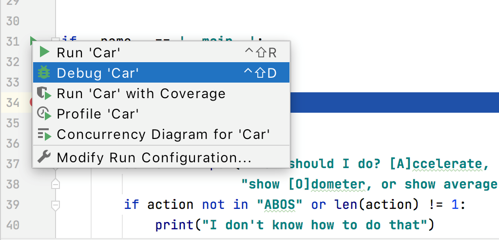

# Troubleshooting

## Starting the Debugger

If you can't find the **Run/Debug** configuration from your main menu, click the Run icon in the gutter to the left of the `main() method` and click **Debug**.

Error | Probably Cause | Action
---------- | ----------- | ----------
Debugging | 
Can't debug a Docker run/debug configuration | PyCharm has a Debugger tool for Python run/debug configurations | Debug the Python script in a Docker container
Process of debugging is slow | Debugger stops on each exception thrown as well as when the process terminates | Go to **Run | View Breakpoints** and in the **Breakpoints** dialog, uncheck the **On Raise** checkbox.
